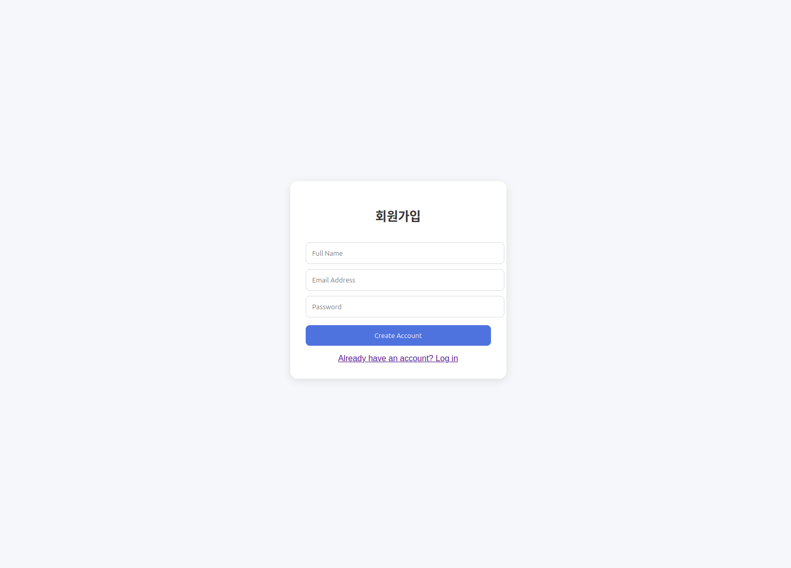
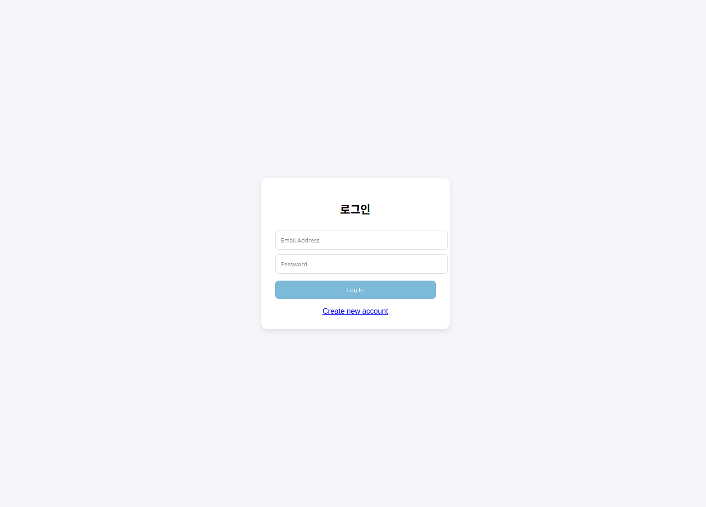
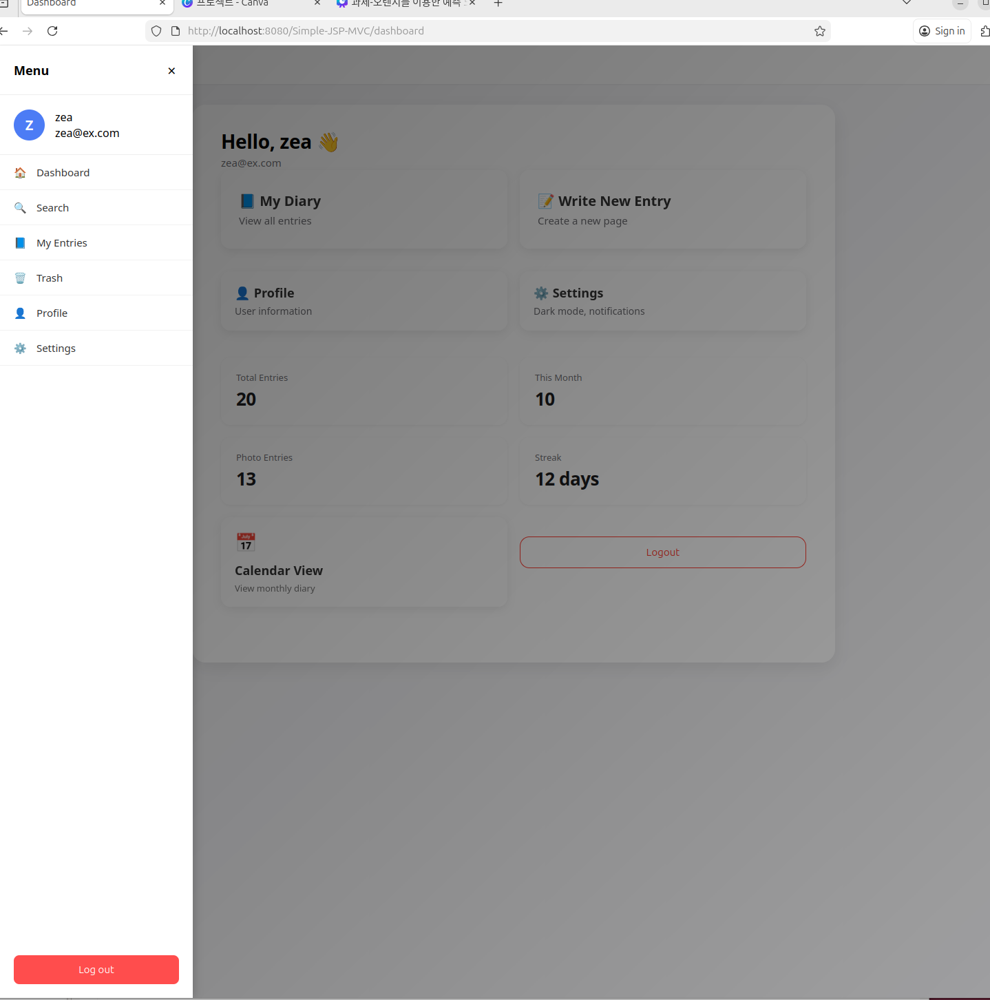
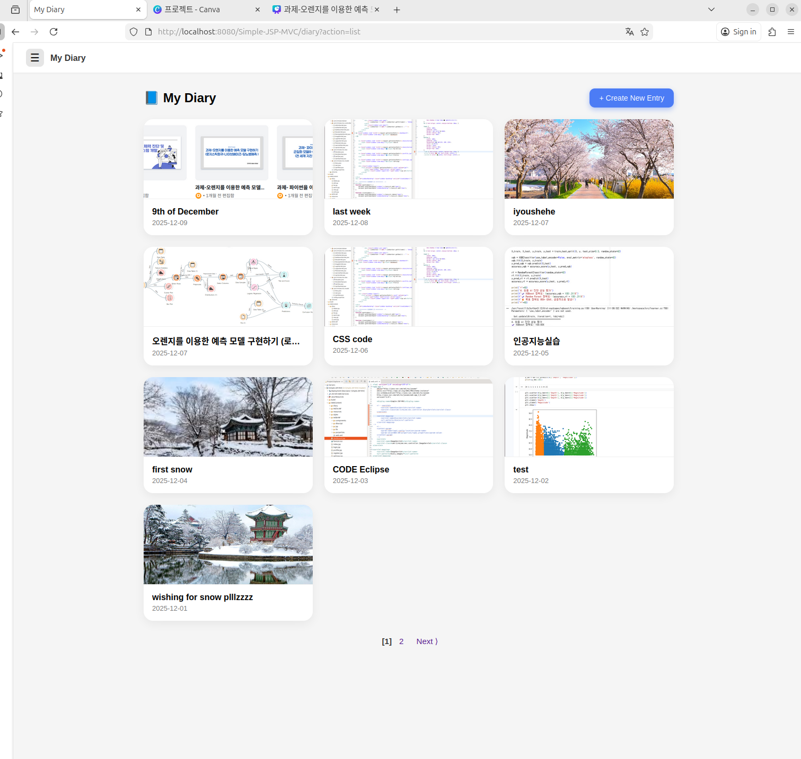
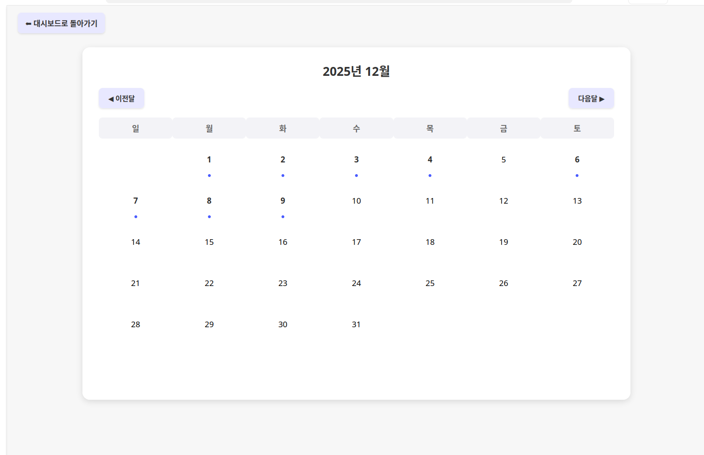
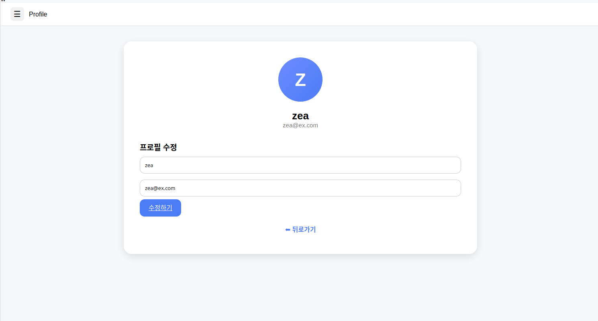
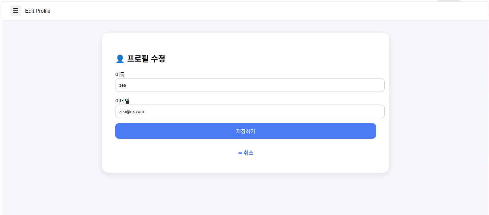

📘 Diary Web Application

Simple-JSP-MVC 기반으로 개발한 개인 일기 웹 애플리케이션

This project is a personal diary web application built using JSP and Servlet
based on the MVC architecture. It allows users to create, edit, and delete diary
entries, as well as upload images stored as BLOB data in a MySQL database.

The project was developed during an internship to practice real server-side
web development using Linux, Apache Tomcat, and MySQL.

---

✨ Features
✔ User Features
- Login / Logout
- Create diary entries
- View diary list
- Edit diary entries
- Delete diary entries
- Upload images (stored in MySQL BLOB)
- Sidebar-based navigation UI

✔ Technical Features
- Simple-JSP-MVC clean architecture
- DAO pattern for database access
- Session-based authentication
- Multipart image upload handling
- MySQL BLOB image storage
- Soft delete logic
- Pagination for diary list
- Calendar-based diary view
- Linux terminal database creation
- JSP application deployment on Apache Tomcat
---
🛠 Tech Stack

| Category     | Technology              |
|--------------|-------------------------|
| Backend      | Java, Servlet, JSP      |
| Database     | MySQL (BLOB storage)    |
| Server       | Apache Tomcat 9         |
| Frontend    | JSP, HTML, CSS          |
| OS           | Linux (Ubuntu)          |
| Tools        | Eclipse IDE             |
| Architecture | Simple JSP MVC          |

---
📁 Project Structure
The project follows a standard MVC-based directory structure:
```
src/
└─ com.tirmizee.mvc
├─ controller
├─ dao
├─ model

WebContent/
├─ WEB-INF/
│ └─ views
├─ assets
└─ index.jsp

docs/
└─ screenshots

sql/
└─ schema.sql
```
---
🧩 MVC Architecture Overview
This application follows the MVC (Model–View–Controller) architecture:

- Model: Handles data logic and database interaction using DAO pattern
- View: JSP pages responsible for UI rendering
- Controller: Servlets that handle HTTP requests and responses

This separation improves code readability, maintainability, and scalability.

---
🗃 Database Schema (Logical ERD)

The database is designed to support users and diary entries.
Images are stored as BLOB data in the diary table.

Key design features:
- User and Diary tables with relational mapping
- Logical delete using boolean flag
- Efficient handling of large image data

(Refer to `sql/schema.sql` for details)

---
🧪 Testing & Validation

The application was manually tested during development to verify
the correct behavior of core features.

- User registration and login tested with valid and invalid data
- Session handling and logout verified
- Diary CRUD functions tested
- Image upload tested with multiple image files
- Pagination and calendar view tested with multiple entries
- Database integrity verified using MySQL queries

No critical errors were found during testing.

---
📌 What I Implemented

Although the project was based on an existing Simple-JSP-MVC template,
the following features were independently implemented and customized:

- Designed and implemented the database schema
- Implemented user authentication (register, login, logout)
- Implemented diary CRUD functionality
- Implemented image upload with MySQL BLOB storage
- Implemented soft delete logic
- Added pagination for diary list
- Implemented calendar-based diary view
- Integrated Summernote WYSIWYG editor
- Improved UI structure and navigation
- Configured and tested the application on Apache Tomcat

---
🔮 Future Improvements

- Search and filter functionality for diary entries
- Tag-based diary categorization
- User profile and settings page
- UI/UX improvements (dark mode, responsive layout)
- Enhanced security (password hashing, validation)

---
🙏 Credits

This project is based on the **Simple-JSP-MVC** template.

- Original repository: https://github.com/tirmizee/Simple-JSP-MVC

The original project did not specify a license.
This repository is used **for educational purposes only** and includes
significant modifications and extensions made as part of an academic internship project.
## 📸 Screenshots

- 회원가입
  
  
- 로그인 
  
  
  - Sidebar
  

- 메인화면
  

- 새 일기 작성
  
  
- 일기 수정
 

- Calendar View  
  
  

- 설정
  
  
 - 다크모드 설정
  

- 프로필
  

- 프로필 수정
  

- 휴지통
  

- 휴지통 비우기 
  
