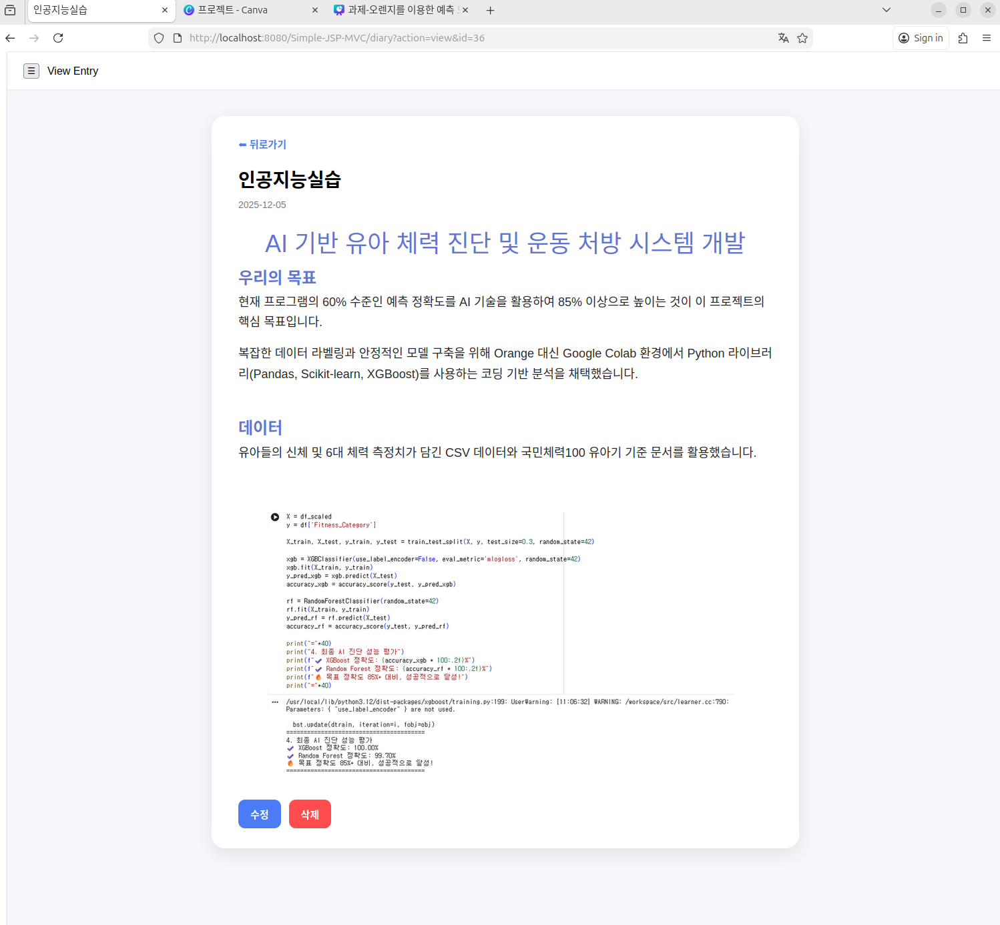

> This project is based on an existing **Simple-JSP-MVC** template and was extended
> and customized as part of an academic project.

## 🙏 Credits

This project is based on the **Simple-JSP-MVC** template.

- Original repository: https://github.com/tirmizee/Simple-JSP-MVC

The original project did not specify a license.
This repository is used **for educational purposes only** and includes
significant modifications and extensions made as part of an academic project.

## 📸 Screenshots

- Login  
  

- Diary List (Pagination)  
  

- Write   
  
  
- Edit (Summernote)  
 

- Calendar View  
  
  
  - Settings Dark Mode  
  

- Delete  
  

- Profile  
  

- Profile  change
  

- Register
  

- Settings
  

- Sidebar
  

- Trash
  

- Trashdelete
  

- View
  

